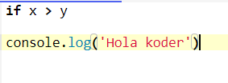
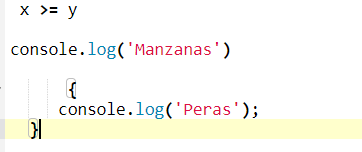

# Compendio de ejercicios
### Encuentren la solución a los siguientes ejercicios, añadan las respuestas con imágenes del código en sus propios repositorios, tienen 15 horas para realizarlos a partir del termino de la clase.

1. Crea una variable llamada fruta y asígnale el valor Manzana.

2. Crea una variable llamada c, ahora asígnale el valor 50.

3. Muestra la suma de 3 + 10, utilizando dos variables: x , y.

4. Crea una variable llamada z, ahora asígnale x + y. Después muestra el resultado en consola.

5. En una sola línea declara tres variables con los siguientes nombres y valores:
    - primerNombre | "David"
    - apellido | "Mendoza"
    - edad | 26

6. Crea dos variables, asígnales valores númericos, multiplícalas entre sí y muestra el resultado en consola.

7. Muestra en consola el residuo de dividir 13 y 7.

8. Crea una variable cuyo valor sea 15 y otra 5, utiliza el operador de asignación adecuado para añadirle a la primera variable el valor 20 (pista: es la forma simplificada de a = a + b).

9. Crea una variable cuyo valor sea 10 y otra 3, utiliza el operador de asignación adecuado para añadirle a la primera variable el valor 30.

10. Teniendo una variable que vale 10 y otra 8, muestra en consola si es verdad que la primera variable vale más que la segunda.

11. Teniendo una variable que vale 24 y otra 24, muestra en consola si es verdad que la primera y segunda variable valen lo mismo.

12. Teniendo una variable que vale 7 y otra 3, muestra en consola si es verdad que la primera no vale lo mismo que la segunda variable.

13. Completa el siguiente código y explica que es lo que realiza.

    

14. Completa el siguiente código y explica que es lo que realiza.

    